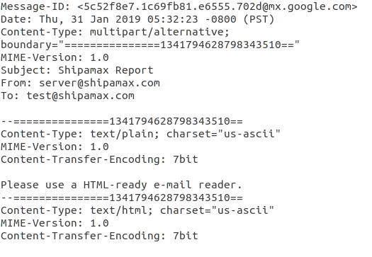

# Getting started

The Shipmax Freight Forwarding API allows developers to create applications that automatically extra data from various documents received by their businesses.

If you would like to use this API and are not already a Shipamax Freight Forwarding customer, please contact our [support team](mailto:support@shipamax.com).

Example code can be found at
[https://github.com/shipamax/samples/tree/master/freightforwarding](https://github.com/shipamax/samples/tree/master/freightforwarding)

## API basics

The API is [RESTful](https://en.wikipedia.org/wiki/Representational_state_transfer#Applied_to_Web_services), and messages are encoded as JSON documents

### Endpoint

The base URI for all API endpoints is `https://developer.shipamax-api.com/api/v1/`.

### Content type

Unless specified otherwise, requests with a body attached should be sent with a `Content-Type: application/json` HTTP header.

### Authorization

With the exception of logging in, all API methods require you to be authenticated. Once you have an access token ([see below](#logging-in)) you can send it along with any API requests you make in a header. If your access token was `abc123`, you would send it as the HTTP header `Authorization: abc123`.

# Common actions

The full API details are laid out in the reference section below. This section gives a simple overview of the most common API methods.

## Logging in

```javascript
{
  "username": "me@example.com",
  "password": "abc123"
}
```

Log in by making a `POST` request to `https://developer.shipamax-api.com/api/v1/users/login`. The body of the request must be a JSON encoded object with string properties 'username' and 'password'.

```javascript
{
  "id":"AAAAAA",
  "ttl": 1209600,
  "created": "2019-03-04T11:24:32.815Z",
  "userId": 1
}
```

If the details you have supplied are correct then the response will also be a JSON object. The `id` property contains your access token.


## Uploading documents

There are two ways to send documents to be processed.

### Via the API
```http
POST /api/v1/DocumentContainers/upload?customId=XYZ HTTP/1.1
Host: developer.shipamax-api.com
Authorization: abc123
Content-Type: multipart/form-data; boundary=------------------------d74496d66958873e

--------------------------d74496d66958873e
Content-Disposition: form-data; name="file"; filename="bol.pdf"
Content-Type: application/pdf

contents of the file
--------------------------d74496d66958873e--
```

You can upload new documents by making a `POST` request to `https://developer.shipamax-api.com/api/v1/DocumentContainers/upload`. These requests require  a `customId` parameter, which is your identifier for this document. This is the ID that you will use to retrieve the processed document in the future. The ID does *not* need to be unique across your company, but re-using an ID will lead to all documents that share that ID being retrieved when you call the `query` endpoint.

The body of the upload request should be a `multipart/form-data` encoded form including at least one file.

The filename and the `name` parameter of the uploaded file can both be whatever you wish. If you attach more than one file to an upload request only the first will be processed.

### Via email

As part of the developer sign up process you are assigned an email forwarding address. If you need one please contact
[support@shipamax.com](support@shipamax.com).

Any attachments found in emails sent to that address will be processed as though they had been individually uploaded throught the API.

#### Custom ID for email forwarding

When you forward emails to a forwarding account you will need to match that email to a custom ID so you can retrieve the results via API. You can use the Message-ID field to query parsing results.



In this example custom ID would be `5c52f8e7.1c69fb81.e6555.702d@mx.google.com`.
More information about the email Message-ID can be found here
[https://tools.ietf.org/html/rfc5322](https://tools.ietf.org/html/rfc5322).

<aside class="notice">For an email with multiple attachments, all of the document container objects will have the same custom ID.</aside>

## Querying documents

To find out the processing status of uploaded documents and retrieve the results, you can make a `GET` request to `https://developer.shipamax-api.com/api/v1/DocumentContainers/query`. The single required query parameter is `customIds` and should be a JSON encoded array of custom IDs.

In the case of documents sent to us via email, the custom ID will be the `Message-ID` header of the email that we receive. For documents uploaded via the API, the custom ID is provided by you as detailed above.

```javascript
// REQUEST:
// https://developer.shipamax-api.com/api/v1/DocumentContainers/query?customIds=%5B%22XYZ%22,%22ABC%22,%22DEF%22%5D

// RESPONSE:
{
  "invalid": ["ABC"],
  "processing": ["DEF"],
  "results": [
    {
      "created": "2018-10-09T12:00:00.000Z",
      "customId": "XYZ",
      "filename": "bol.pdf",
      "id": 123,

      ...detail omitted, see below...
    },
  ],
}
```

The result is a JSON object with three keys. The `invalid` property is an array of custom ID strings that we did not recognise. That is, the ID is not a match for any uploaded document or received email.

The `processing` property is an array of customId strings for which we do have a record of receiving, but that we have not yet started parsing.

Finally, the `results` property is an array of the document container details for the remaining custom IDs.

A "document container" is a file that may contain a document. So, for example, "bol.pdf" is a PDF file that contains a bill of lading. We seperate the concepts of the *file* and the *document contained* in the file, so that "bol.pdf" is a `DocumentContainer`, while the bill of lading itself is a `BillOfLading`.

<aside class="warning">
KNOWN ISSUE: The document containers that we return in the <code>results</code> array may not be fully processed. This means that you may get a document container that should contain a bill of lading, but where the <code>billOfLading</code> property of that document container is empty. We aim to make it possible to determine the difference between an empty document container and an unprocessed document container in the future.
</aside>

## Corrections
You may find that the parser has made a mistake when reading a document. You can submit corrections to documents using the `PUT` and `POST` REST actions for the appropriate objects, as detailed in the reference section below.

Users will always see the most recent corrected version of any document. However, for the purposes of improving our parser, we always keep a copy of the original parsed version of any document for comparison.

## Providing feedback

```javascript
{
  "feedbackType": "number",
  "value": "string",
  "userId": "number",
  "documentId": "number"
}
```

You can pass on feedback from your users about the quality of the document parser using the feedback API.

`POST` a request to `https://developer.shipamax-api.com/api/v1/Feedback/`. The body of the request should be a JSON encoded object.


- `feedbackType`: See the table below
- `value`: A JSON encoded object, specific to the type of feedback. All kinds of feedback object allow a `comment` property for free-text remarks related to the feedback.
- `userId`: The ID of the user on whose behalf you are saving the feedback.
- `documentId`: The ID of the document container to which the feedback relates. Note that this is *not* the `customId`, but the `id` field of the `DocumentContainer` object received from the `query` API call.


### Feedback types

```javascript
// DocumentMissed feedback type
{
  "comment": "optional free text comment",
  "type": "BillOfLading"
}
```

```javascript
// All quality feedback types
{
  "comment": "optional free text comment",
  "rating": 1,
  "id": 1234
}
```

| ID  | Name                   | Description                                                  |
| --- | ---------------------- | ------------------------------------------------------------ |
| 1   | DocumentMissed         | The file contained a document that the system has not parsed |  |
| 2   | BillOfLadingQuality    | A rating for the parsing quality of a bill of lading         |
| 3   | ArrivalNoticeQuality   | A rating for the parsing quality of an arrival notice        |
| 4   | DeliveryOrderQuality   | A rating for the parsing quality of a delivery order         |
| 5   | SupplierInvoiceQuality | A rating for the parsing quality of a supplier invoice       |

```javascript
// Document container details
{
  "id": 123,
  ...
  "billOfLading": [
    {
      "id": 345
      ...
    }
  ]
}
```

```javascript
// Feedback for the above bill of lading
{
  "feedbackType": 2,
  "value": {
    "comment": "The parser did a great job, even though the doc was a bad photocopy",
    "rating": 1,
    "id": 345,
  },
  "userId": 1,
  "documentId": 123
}
```

For the quality feedback, the rating should be `-1` for a negative review, `0` for neutral review, and `1` for a positive review. The `id` should be the ID received for the specific document, and the `type` property is a string representing the missed document type: `BillOfLading`, `ArrivalNotice`, `DeliveryOrder`, `SupplierInvoice`.

# Reference

You can see all of the properties of the various REST objects in our [reference spreadsheet](http://storage.shipamax-api.com/ApiDefinition.xlsx).

## Document container
| Endpoint                   | Verb | Description       |
| -------------------------- | ---- | ----------------- |
| /DocumentContainers/query  | GET  | Described above.  |
| /DocumentContainers/upload | POST | Describved above. |

## Arrival notice
| Endpoint            | Verb  | Description                                                                     |
| ------------------- | ----- | ------------------------------------------------------------------------------- |
| /ArrivalNotice/{id} | PATCH | Update an existing ArrivalNotice. Only changed properties need to be included.  |
| /ArrivalNotice/{id} | PUT   | Replace an existing ArrivalNotice. Any properties not included will be removed. |

## Arrival notice container
| Endpoint                      | Verb   | Description                                                                              |
| ----------------------------- | ------ | ---------------------------------------------------------------------------------------- |
| /ArrivalNoticeContainers/{id} | PATCH  | Update an existing ArrivalNoticeContainer. Only changed properties need to be included.  |
| /ArrivalNoticeContainers/{id} | PUT    | Replace an existing ArrivalNoticeContainer. Any properties not included will be removed. |
| /ArrivalNoticeContainers      | POST   | Create a new ArrivalNoticeContainer. Must include the parent ID.                         |
| /ArrivalNoticeContainers/{id} | DELETE | Delete an ArrivalNoticeContainer.                                                        |

## Bill of lading
| Endpoint            | Verb  | Description                                                                    |
| ------------------- | ----- | ------------------------------------------------------------------------------ |
| /BillOfLadings/{id} | PATCH | Update an existing BillOfLading. Only changed properties need to be included.  |
| /BillOfLadings/{id} | PUT   | Replace an existing BillOfLading. Any properties not included will be removed. |

## Bill of lading container
| Endpoint                     | Verb   | Description                                                                             |
| ---------------------------- | ------ | --------------------------------------------------------------------------------------- |
| /BillOfLadingContainers/{id} | PATCH  | Update an existing BillOfLadingContainer. Only changed properties need to be included.  |
| /BillOfLadingContainers/{id} | PUT    | Replace an existing BillOfLadingContainer. Any properties not included will be removed. |
| /BillOfLadingContainers      | POST   | Create a new BillOfLadingContainer. Must include the parent ID.                         |
| /BillOfLadingContainers/{id} | DELETE | Delete a BillOfLadingContainer.                                                         |

## Bill of lading goods
| Endpoint                | Verb   | Description                                                                         |
| ----------------------- | ------ | ----------------------------------------------------------------------------------- |
| /BillOfLadingGoods/{id} | PATCH  | Update an existing BillOfLadingGoods. Only changed properties need to be included.  |
| /BillOfLadingGoods/{id} | PUT    | Replace an existing BillOfLadingGoods. Any properties not included will be removed. |
| /BillOfLadingGoods      | POST   | Create a new BillOfLadingGoods. Must include the parent ID.                         |
| /BillOfLadingGoods/{id} | DELETE | Delete a BillOfLadingGoods.                                                         |

## Delivery order
| Endpoint             | Verb  | Description                                                                     |
| -------------------- | ----- | ------------------------------------------------------------------------------- |
| /DeliveryOrders/{id} | PATCH | Update an existing DeliveryOrder. Only changed properties need to be included.  |
| /DeliveryOrders/{id} | PUT   | Replace an existing DeliveryOrder. Any properties not included will be removed. |

## Delivery order container
| Endpoint                      | Verb   | Description                                                                              |
| ----------------------------- | ------ | ---------------------------------------------------------------------------------------- |
| /DeliveryOrderContainers/{id} | PATCH  | Update an existing DeliveryOrderContainer. Only changed properties need to be included.  |
| /DeliveryOrderContainers/{id} | PUT    | Replace an existing DeliveryOrderContainer. Any properties not included will be removed. |
| /DeliveryOrderContainers      | POST   | Create a new DeliveryOrderContainer. Must include the parent ID.                         |
| /DeliveryOrderContainers/{id} | DELETE | Delete a DeliveryOrderContainer.                                                         |

## Supplier invoice
| Endpoint               | Verb  | Description                                                                       |
| ---------------------- | ----- | --------------------------------------------------------------------------------- |
| /SupplierInvoices/{id} | PATCH | Update an existing SupplierInvoice. Only changed properties need to be included.  |
| /SupplierInvoices/{id} | PUT   | Replace an existing SupplierInvoice. Any properties not included will be removed. |

## Supplier invoice line item
| Endpoint                       | Verb   | Description                                                                               |
| ------------------------------ | ------ | ----------------------------------------------------------------------------------------- |
| /SupplierInvoiceLineItems/{id} | PATCH  | Update an existing SupplierInvoiceLineItem. Only changed properties need to be included.  |
| /SupplierInvoiceLineItems/{id} | PUT    | Replace an existing SupplierInvoiceLineItem. Any properties not included will be removed. |
| /SupplierInvoiceLineItems      | POST   | Create a new SupplierInvoiceLineItem. Must include the parent ID.                         |
| /SupplierInvoiceLineItems/{id} | DELETE | Delete a SupplierInvoiceLineItem.              |

## Feedback
| Endpoint    | Verb | Description      |
| ----------- | ---- | ---------------- |
| /Feedbacks/ | POST | Described above. |

## User
| Endpoint      | Verb | Description                           |
| ------------- | ---- | ------------------------------------- |
| /users/login  | POST | Described above.                      |
| /users/logout | POST | Invalidates the current access token. |
